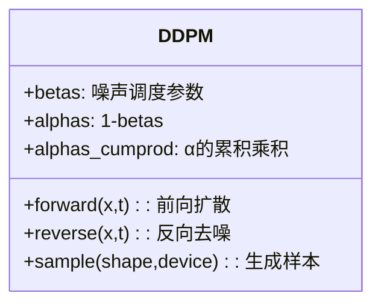
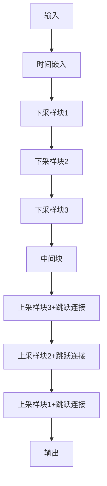

# DDPM实现详解

## 1. DDPM基本原理

扩散概率模型(DDPM)通过两个过程学习数据分布：
1. **前向过程(扩散过程)**：逐步向数据添加高斯噪声
2. **反向过程(去噪过程)**：学习逐步去除噪声，恢复原始数据

### 数学公式

- 前向过程：
  ```math
  q(x_t|x_{t-1}) = N(x_t; √(1-β_t)x_{t-1}, β_tI)
  ```
- 反向过程：
  ```math
  p_θ(x_{t-1}|x_t) = N(x_{t-1}; μ_θ(x_t,t), Σ_θ(x_t,t))
  ```

- 损失函数(简化)：
  ```math
  L = E[||ε - ε_θ(x_t,t)||^2]
  ```

## 2. 代码结构

项目包含4个主要文件：

```
DDPM/
├── ddpm_model.py  # DDPM核心实现
├── unet.py       # UNet模型架构
├── train.py      # 训练脚本
└── test.py       # 测试生成脚本
```

## 3. 核心实现解析(ddpm_model.py)



关键方法：
- `forward()`: 实现前向扩散过程，根据时间步t添加噪声
- `reverse()`: 调用UNet预测噪声
- `sample()`: 从纯噪声开始逐步去噪生成样本

## 4. UNet模型架构(unet.py)



UNet包含：
- 时间嵌入层：将时间步t编码为向量
- 下采样块：逐步压缩特征图
- 上采样块：逐步恢复分辨率，结合跳跃连接
- 中间块：处理最底层特征

## 5. 训练流程(train.py)

1. 准备FashionMNIST数据集
2. 随机采样时间步t
3. 前向过程添加噪声
4. UNet预测噪声
5. 计算MSE损失并反向传播

```python
# 核心训练代码
noisy_data, noise = ddpm(data, t)  # 前向扩散
pred_noise = ddpm.reverse(noisy_data, t)  # 预测噪声
loss = F.mse_loss(pred_noise, noise)  # 计算损失
```

## 6. 测试生成流程(test.py)

1. 加载训练好的模型
2. 从随机噪声开始
3. 逐步去噪生成样本
4. 可视化结果

```python
samples = ddpm.sample((16, 1, 28, 28), device)  # 生成16个样本
```

## 7. 示例输出


## 8. 总结

DDPM通过以下步骤工作：
1. 训练UNet预测添加的噪声
2. 在生成时，从噪声开始逐步去噪
3. 通过多次迭代得到高质量样本

关键优势：
- 生成质量高
- 训练稳定
- 理论保证
